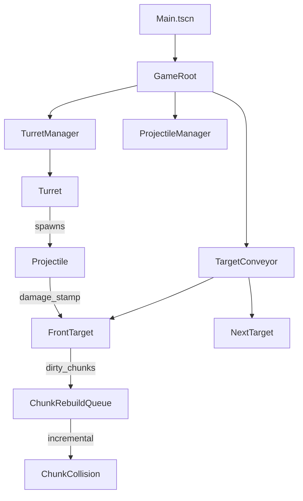

# Godot 4.6.2 turret + infinite destructible target plan

## Core idea
- **Target = chunked high-res grid**, not per-pixel. Each chunk own:
  - `BitSet` / `PackedByteArray` occupancy (solid/empty)
  - Visual: mesh or `MultiMeshInstance2D` from occupied cells
  - Collision: shapes from occupied cells (merged rects)
- **Mobile 60fps rules**
  - No full-target collision rebuild.
  - Rebuild only dirty chunks.
  - Budget per frame. Spread work across frames.

## Scene & folder layout
- `res://scenes/Main.tscn`
  - `GameRoot` (Node)
    - `World2D` (Node2D)
      - `TurretManager` (Node2D)
      - `TargetConveyor` (Node2D)
      - `ProjectileManager` (Node2D)
    - `UI` (CanvasLayer)
      - `ShopPanel`
      - `UpgradePanel`
      - `CurrencyHUD`
- `res://scenes/target/DestructibleTarget.tscn`
  - `DestructibleTarget` (Node2D)
    - `Chunks` (Node2D)
- `res://scenes/turrets/Turret.tscn`
  - `Turret` (Node2D)
    - `Barrel` (Node2D)
- `res://scenes/projectiles/Projectile.tscn`
  - `Projectile` (Area2D)

## Data model
- `res://data/TurretCatalog.tres` (or JSON): turret types
  - base fire rate, range, targeting mode, projectile type, base damage
- `res://data/Upgrades.tres`: per-turret upgrade tracks
  - damage, fire rate, crit, pierce, AoE, etc.
- `res://data/ProjectileCatalog.tres`: projectile behaviors
  - hitscan, arc, pierce, bounce, DoT, explosive

## Systems

### 1) TargetConveyor (infinite target)
- Keep max 2 targets:
  - `frontTarget` in view
  - `nextTarget` behind, offscreen
- When `frontTarget` fully destroyed:
  - Slide `nextTarget` in, slide `frontTarget` out
  - Swap refs, spawn new `nextTarget` behind
- Turrets aim active target via `TargetConveyor.get_active_target()`.

### 2) DestructibleTarget (chunk destroy)
- Target local rect → grid cells.
- Split chunks (start `chunk_size = 32x32` cells; tune mobile).
- Per chunk:
  - **Occupancy**: bit-pack `solid[cell_index]`
  - **Render**
    - Option A fast: `MeshInstance2D` quads, greedy merge rects
    - Option B easy: atlas + `MultiMeshInstance2D`, update instances per chunk
  - **Collision**
    - Rect collisions: merged rects as `CollisionPolygon2D`/`CollisionShape2D` under `StaticBody2D`
    - Greedy rect merge each rebuild
- Damage:
  - Projectile compute hit cells (circle/line stamp) in target-local grid
  - Mark touched chunks dirty
- Rebuild schedule:
  - Queue `dirty_chunks`
  - Each frame rebuild within budget (N chunks or max ms)

### 3) TurretManager + targeting
- Placement: fixed slots or free (decide later).
- Target loop:
  - Each turret pick aim point on active target (closest on bounds, or weak-spot marker)
  - Fire when cooldown done
- Spawn via `ProjectileManager.spawn(projectile_type, origin, dir, params)`.

### 4) Projectiles (unique feel)
Composition:
- Base `Projectile`: move, lifetime, collision query
- Behavior modules (script/resource):
  - `on_spawn`, `on_hit`, `on_tick`
Mobile collision:
- Most: `Area2D` small shape
- Fast: per-frame ray segment last→now (no tunnel)

### 5) Economy/shop/upgrades
- Currency from damage and/or chunks destroyed.
- Shop UI:
  - Buy turret type
  - Upgrade turret levels (spend currency)
- Save:
  - `res://save/SaveGame.gd` store currency, owned turrets, upgrade levels

## Collision update details (chunk grid)
- Chunk rebuild (per chunk):
  - Input: occupancy grid
  - Greedy merge rects across rows/cols → small set axis-aligned rects
  - Update only shapes for that chunk
- Avoid concave poly split. Mobile stable.

## Visuals & UX
- Destruction feel:
  - Particles on hit
  - Small screen shake
  - Brief tint damaged cells (crumble vibe)
- Conveyor:
  - Ease slide + light parallax bg
  - Keep firing. Switch aim when slide start. Allow hits during overlap.

## Performance guardrails (mobile)
- Fixed physics tick. Do rebuild in `_process` with budget.
- Cap projectiles. Pool instances.
- Chunk tuning:
  - Big chunk = fewer nodes, heavier rebuild
  - Small chunk = more nodes, lighter rebuild
  - Start 32x32. Aim ~10–25 chunks visible.

## Key risks & mitigations
- **Too many collision shapes**: merge rects, cap rebuild per frame
- **Projectile hit cost**: ray/area checks, no big per-cell scan (only small stamp radius)
- **Seamless swap**: keep 2 targets, turrets query active target each shot

## Milestones
- M1: Conveyor + placeholder targets slide clean
- M2: Chunk occupancy + visual destroy (no collision)
- M3: Dirty-chunk incremental collision rebuild
- M4: One turret + one projectile damage target
- M5: Shop + upgrades + 3 turret types, distinct projectiles
- M6: Mobile perf pass (pooling, budgets, chunk size)

## Mermaid architecture

